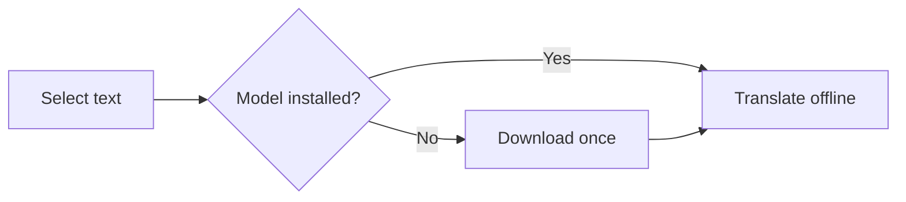
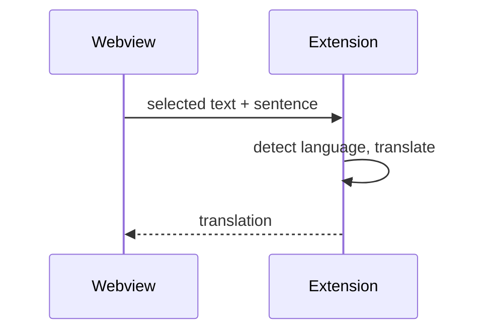

# Folio

This document exercises every feature of the extension. Open it with
**Cmd+K V** (or **Ctrl+K V**), then select words in the preview to see their
translation. The front matter above must be hidden.

## 1. Translation

### Single words

Try selecting just one word: *library*, *window*, *spring*, *bank*, *light*.
Words like **bank** or **spring** have several meanings, so the surrounding
sentence matters: I left my money at the bank. The river bank was covered in
flowers. Spring is my favourite season, but the spring in this old clock is
broken.

### Sentences

The quick brown fox jumps over the lazy dog. The cat sleeps on the sofa all
afternoon, while the rain keeps falling outside the window.

Machine translation runs entirely on your computer, so your documents never
leave it. The first translation after starting the editor takes a moment,
because the language model has to be loaded into memory.

### A whole paragraph

Select this entire paragraph to test a longer translation. Open source
software is software whose source code is available for anyone to inspect,
modify and distribute. Many of the tools developers use every day, from
compilers to text editors, are built and maintained by communities of
volunteers and companies working together.

### Too long (more than 500 characters)

Select all of this paragraph: the tooltip should say that the selection is
too long. Lorem ipsum dolor sit amet, consectetur adipiscing elit, sed do
eiusmod tempor incididunt ut labore et dolore magna aliqua. Ut enim ad minim
veniam, quis nostrud exercitation ullamco laboris nisi ut aliquip ex ea
commodo consequat. Duis aute irure dolor in reprehenderit in voluptate velit
esse cillum dolore eu fugiat nulla pariatur. Excepteur sint occaecat
cupidatat non proident, sunt in culpa qui officia deserunt mollit anim id est
laborum. Sed ut perspiciatis unde omnis iste natus error sit voluptatem.

### Other languages

These sentences test automatic language detection. Languages other than
English need their own model, plus English → Italian (they go through
English):

- German: Das ist ein Geschenk für dich. Das ist ein Gift, trink es nicht.
- French: Le chat dort sur le canapé tout l'après-midi.
- Spanish: El tren sale de la estación a las ocho de la mañana.
- Portuguese: O livro está em cima da mesa da cozinha.
- Russian: Мы говорили об этом вчера вечером.
- Ukrainian: Кіт спить на дивані весь день.
- Czech: Kočka spí na gauči celé odpoledne.
- Italian (already in the target language): Il gatto dorme sul divano.

### Text inside other elements

> Select a word inside this quote: knowledge is power.

| Term      | Description                                  |
| --------- | -------------------------------------------- |
| Keyboard  | A device used to type text into a computer.  |
| Bookshelf | A piece of furniture for storing books.      |

Words inside [a link to the other file](./other.md) can be selected without
opening the link. Text in `inline code` and in lists works too:

1. Open the preview.
2. Select a sentence.
3. Read the translation below it.

> [!TIP]
> Press Esc or click anywhere else to close the tooltip.

> [!WARNING]
> Scroll near the bottom of the window and select a word: the tooltip must
> flip above the selection instead of leaving the window.

## 2. Formatting

Plain text with **bold**, *italic*, *** ***, ~~strikethrough~~,
==highlighted==, H~2~O, E = mc^2^, and an emoji :smile: :rocket:.

Definition list
: A term followed by its definition.

The HTML specification is maintained by the W3C.

*[HTML]: HyperText Markup Language
*[W3C]: World Wide Web Consortium

A sentence with a footnote.[^1]

[^1]: This is the footnote text.

- [x] Task done
- [ ] Task to do
  - [ ] Nested task

---

## 3. Code

```typescript
interface User {
  name: string;
  age: number;
}

function greet(user: User): string {
  return `Hello, ${user.name}!`;
}
```

```python
def fibonacci(n: int) -> list[int]:
    sequence = [0, 1]
    while len(sequence) < n:
        sequence.append(sequence[-1] + sequence[-2])
    return sequence
```

```bash
npm install && npm run build
```

```unknown-language
This block has no syntax highlighting.
```

## 4. Math

Inline math: $e^{i\pi} + 1 = 0$ and $\sqrt{a^2 + b^2}$.

$$
\int_{-\infty}^{\infty} e^{-x^2} \, dx = \sqrt{\pi}
$$

```math
\sum_{k=1}^{n} k = \frac{n(n+1)}{2}
```

## 5. Diagrams





## 6. Images and HTML

A relative image:


Raw HTML is allowed but sanitized:

<details>
<summary>Click to expand</summary>

Hidden content that you can also translate: the weather is lovely today.

</details>

<p align="center"><strong>Centered HTML paragraph</strong></p>

## 7. Links

- [Jump to the Code section](#3-code)
- [Open the other Markdown file](./other.md)
- [External website](https://code.visualstudio.com)

## 8. Scroll sync

Scroll the editor: the preview should follow. Scroll the preview: the editor
should follow. The sections below add length.

### Filler section A

Reading is one of the best ways to learn a new language. Start with short
texts, look up the words you do not know, and read the same text again a few
days later.

### Filler section B

A good habit is to write down new words together with the sentence where you
found them. Context makes words much easier to remember than lists.

### Filler section C

Practice a little every day. Ten minutes of regular practice are worth more
than two hours once a week.

## 9. Reading aids

Move the mouse: the **table of contents** button appears top left. Open it —
the section you are reading is highlighted, and the header shows the reading
time left. In **All settings → Reading** try a serif font, airy line spacing
or focus mode.

Select *a word or two in this sentence* and choose **Add note**: the text is
highlighted with a pin in the margin, and the note is saved in
`demo.md.folio.json` next to this file. Hover a code block for its **Copy**
button, click the image in section 6 to zoom it, and use **Copy as formatted
text** in the settings panel, then paste into an email.

### The end

If you can read this in the preview, rendering, themes and scroll sync all
work. Try **Folio: Select Preview Theme** and pick *sepia* for a
warm reading theme, then **Export PDF**.
