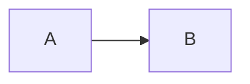

# Sample document

Some **bold** text, `inline code`, a [relative link](./other.md#second) and an image:


| Column | Value |
| ------ | ----- |
| a      | 1     |

```python
def hello():
    return "world"
```

> [!TIP]
> Alerts work.

Math: $e^{i\pi} + 1 = 0$



- [x] done
- [ ] todo
